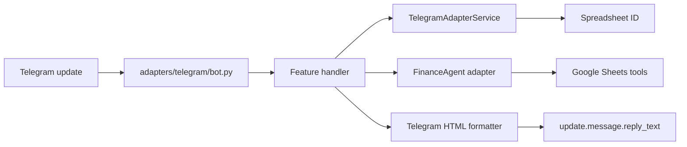
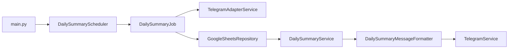
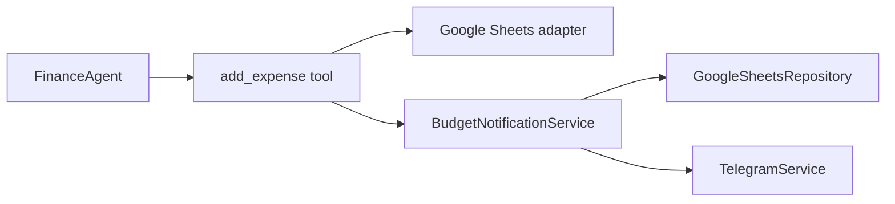

# Implemented Architecture

## Overview

The Finance Assistant uses a feature-slice architecture with shared provider adapters.
User-facing capabilities are grouped under `src/finance_assistant/features`, while Telegram,
Google Sheets, agent, and scheduling integrations are grouped under
`src/finance_assistant/adapters`.

The application entrypoint composes the daily summary scheduler and Telegram bot. Feature
handlers own the workflow for their capability and call shared adapters when they need an
external provider.

## Package Layout

```text
src/finance_assistant/
  main.py
  features/
    audio/
      handler.py
    budget_notification/
      service.py
    daily_summary/
      service.py
      formatter.py
      job.py
      scheduler.py
    finance_command/
      handler.py
    help/
      handler.py
    income/
      handler.py
    message/
      handler.py
    recurring/
      handler.py
    start/
      handler.py
    summary/
      handler.py
  adapters/
    agents/
      base_agent.py
      response_agent.py
      speech_to_text_agent.py
      *_tool.py
    finance_agent/
      instructions.py
    repositories/
      google_sheets_repository.py
    services/
      recurrence_rule.py
      recurring_job_scheduler.py
    telegram/
      bot.py
      message_builders.py
      message_formatter.py
      telegram_adapter_service.py
      telegram_service.py
```

## Feature Slices

### Telegram input features

Each Telegram input feature exposes a native `(update, context)` callback and owns its route
configuration and workflow:

- `start`: sends onboarding guidance.
- `help`: sends the available command list.
- `summary`: runs the summary workflow against the summary spreadsheet range.
- `recurring`: handles recurring-entry requests against the recurring range.
- `income`: handles income requests against the income range.
- `message`: handles ordinary expense text against the expense range.
- `audio`: downloads and transcribes audio, then processes the transcript as an expense message.
- `finance_command`: provides a generic expense-oriented finance command handler.

Finance handlers resolve the Telegram user, look up the user's spreadsheet, construct the
`FinanceAgent`, execute it within `telegram_user_context`, format the response as Telegram HTML,
and call `reply_text`.

### Daily summary

The `daily_summary` slice contains the complete scheduled summary workflow:

- `service.py` parses and filters rows for the current date.
- `formatter.py` creates the user-facing daily summary message.
- `job.py` reads sheets, resolves users, sends summaries, and isolates per-user failures.
- `scheduler.py` schedules the job through the shared recurrence infrastructure.

### Budget notification

The `budget_notification` slice evaluates category budget usage after an expense is recorded.
It resolves the user's spreadsheet, reads the category budget, applies the threshold policy, and
sends a Telegram alert when usage is above 70 percent or over budget.

The expense adapter invokes this feature as a best-effort follow-up. A notification failure is
logged and does not undo a successfully recorded expense.

## Shared Adapters

### Telegram adapters

`adapters/telegram` contains provider-specific Telegram concerns:

- `bot.py` registers commands and message filters with python-telegram-bot.
- `telegram_adapter_service.py` maps Telegram user IDs to spreadsheet IDs.
- `telegram_service.py` sends messages from synchronous or asynchronous contexts.
- `message_builders.py` contains onboarding and help text.
- `message_formatter.py` converts Markdown-like agent output to Telegram HTML.

### Agent adapters

`adapters/agents` contains the Agno/Gemini response and speech-to-text adapters, Google Sheets
agent tools, and the Telegram user context used by tools during a request.

### Repository adapters

`adapters/repositories` contains the Google Sheets repository used by feature jobs and services.
Provider-specific spreadsheet API calls stay in this boundary.

### Scheduling adapters

`adapters/services` contains reusable recurrence rules and the recurring job loop. Feature
schedulers configure these primitives but do not reimplement scheduling behavior.

### Finance-agent adapter

`adapters/finance_agent/instructions.py` builds the shared FinanceAgent prompt, including the
selected spreadsheet ID, active range, current date, and income-specific instructions.

## Runtime Flows

### Telegram message



### Audio message


### Daily summary



### Expense budget alert



## Dependency Rules

1. Feature code owns user-facing workflows and feature-specific constants.
2. Provider SDKs and provider-specific transport details belong under `adapters`.
3. Shared adapters may be used by multiple features; feature code should not duplicate provider setup.
4. `bot.py` is a composition and registration boundary. It should register feature callbacks and
   avoid embedding feature workflow logic.
5. Scheduling primitives remain shared; daily summary scheduling configuration belongs to the
   `daily_summary` feature.
6. Tests should patch dependencies at the module boundary used by the feature under test.
7. New capabilities should receive a new folder under `features` rather than adding another large
   cross-feature handler module.

## Composition Root

`src/finance_assistant/main.py` currently:

1. Creates a `DailySummaryScheduler` configured for 21:00.
2. Creates a `DailySummaryJob`.
3. Registers the job callback with the scheduler.
4. Starts the Telegram bot through `adapters/telegram/bot.py`.

`bot.py` registers the feature handlers for `/start`, `/sumario`, `/recorrente`,
`/rendimentos`, `/ajuda`, ordinary text, and audio/voice messages.

## Testing Strategy

Tests are organized by behavior rather than by adapter implementation:

- `tests/unit/test_agno_gemini_base_agent.py` covers agent tools, feature handlers, formatting,
and speech-to-text behavior.
- `tests/unit/test_daily_summary_job.py` covers daily filtering, formatting, job behavior, and
Telegram delivery.
- `tests/unit/test_budget_notification_service.py` covers budget thresholds and alert policy.
- `tests/unit/test_recurring_job_scheduler.py` covers shared scheduler behavior.
- `tests/integration/test_expense_budget_alerts.py` covers expense recording followed by budget
notification and Telegram user-context propagation.

When moving a module, update both direct imports and string-based monkeypatch targets. The full
suite is the compatibility check for feature moves because many tests exercise cross-feature
adapter wiring.
